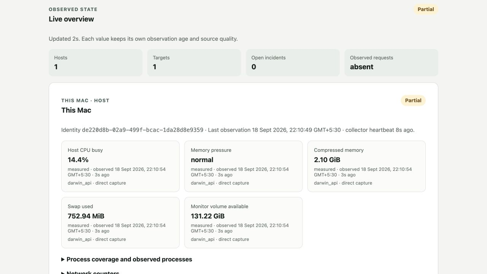

# LLM Monitor

**See what your local Ollama server and Mac are doing, and keep the history when something slows down.**

A same-machine developer preview for **Apple Silicon Macs running native Ollama**. A small background collector reads host resources and Ollama's read-only endpoints. The local master stores observations and serves a browser dashboard. No cloud account, model API key, proxy, or prompt capture is needed.



[Full dashboard](docs/images/dashboard-full.png)

*Actual dashboard capture from the local preview verification. These are observations from one test Mac, not sample measurements or a benchmark. An idle model is not evidence of successful inference.*

## What you can see

- CPU activity, memory pressure, compressed memory, swap and available disk space.
- Ollama reachability, installed models, runtime-reported loaded models and model identities.
- Observation freshness, same-user process coverage and retained resource history.
- In-app alert rules and investigations with saved evidence and notes.

The preview is passive. It never loads or unloads models, upgrades Ollama, or sends inference requests. It does not automatically observe other applications' request latency, token throughput, queue depth, GPU utilization or power.

## Install

**Prerequisites:** an Apple Silicon Mac, macOS 14 or newer, and an existing native Ollama installation. Exact OS/runtime combinations are not all qualified; see [verification](docs/preview-verification.md). Intel Macs, Linux, Windows and containerized Ollama are outside this preview.

1. Download and extract **LLM-Monitor-0.1.0-preview.1-development-bundle.tar.gz** from the [preview release](https://github.com/aiswarya797/RMT_onprem_LLM/releases/tag/v0.1.0-preview.1).
2. Open Terminal in the extracted folder and run:

   ```sh
   ./llm-monitor-install.sh local
   ```

3. The dashboard opens at **http://127.0.0.1:9443**. Create your local administrator account. The collector pairs automatically and discovers Ollama at `127.0.0.1:11434`.

You do not need Go, Node, Docker, a source checkout, or API keys to use the bundle. This is an **unsigned, ad-hoc-signed development build, not a notarized customer release**. macOS may require a manual approval; if installation is blocked, use an assisted trial. Do not disable Gatekeeper or system security. There is no public `curl | sh` installer or automatic updater.

See [installation and recovery](docs/install.md) for the exact steps and what to do if Ollama is stopped or the dashboard cannot open.

## Use it

1. Check **Live overview** and **This Mac** for fresh observations. The first CPU sample needs a second collection interval; missing observations stay unavailable rather than appearing as zero.
2. Check **Ollama target** for reachability and model inventory. “Loaded” means Ollama reports the model resident, not that it is generating.
3. When something feels slow, open the retained history and select the relevant time window. Review resource changes and process observations; save an investigation and a note about what you changed.
4. Configure **Alert rules** for in-app incidents. External notification delivery is disabled in this preview.
5. Leave it running in the background and return to the same local dashboard. User services run while you are logged in; signing out or sleeping the Mac creates a visible collection gap.

For status or to stop the monitor:

```sh
"$HOME/Library/Application Support/LLM Monitor/bin/llm-monitor" status
"$HOME/Library/Application Support/LLM Monitor/bin/llm-monitor" stop
```

Run `./llm-monitor-install.sh local` again to resume; existing history and pairing are preserved. Ollama remains untouched. See [keep-data uninstall](docs/install.md#uninstall) before removing the monitor.

## Preview boundary

| Available by default | Preserved behind a developer gate |
| --- | --- |
| Same-machine collector → master, browser sign-in, passive observations, history, in-app investigations and alerts | Remote pairing/collection, inference probes, request comparisons, external notifications |

The physical two-Mac connection has an unresolved activation failure. Those controls are hidden and their API/CLI paths are disabled by default; no unfinished implementation was deleted. [Experimental workflows](docs/experimental.md) explains the opt-in and known gaps. This is a developer preview for feedback, not production qualification.

All monitoring data stays in your local application directory. No telemetry or external model account is required. The browser binds to loopback. Detailed installation, operation and recovery guides also ship inside the package.

## Feedback

[Open an issue](https://github.com/aiswarya797/RMT_onprem_LLM/issues) with your macOS version, chip/RAM, Ollama version, what you expected and what happened. Please remove credentials, prompts, personal paths and private model identifiers from screenshots/logs. Tell us whether the history helped explain a real slowdown, and what you still had to inspect elsewhere.

## Build from source

Maintainer prerequisites: Go 1.26.8 for Darwin arm64, Node 22.22.2+ / npm 10.9+, and Xcode Command Line Tools.

```sh
npm --prefix web ci --ignore-scripts
GO_BINARY="$(command -v go)" BUILD_ID=development-local \
  ./packaging/macos/build.sh development 0.1.0-local
```

Build output goes to `dist/`. Use `DIST_DIR=/absolute/empty/output` to preserve earlier artifacts. Builds require `-tags sqlite_dbstat`; the package script sets it. [Developer checks](docs/preview-verification.md) list what was actually exercised and remaining qualification.
